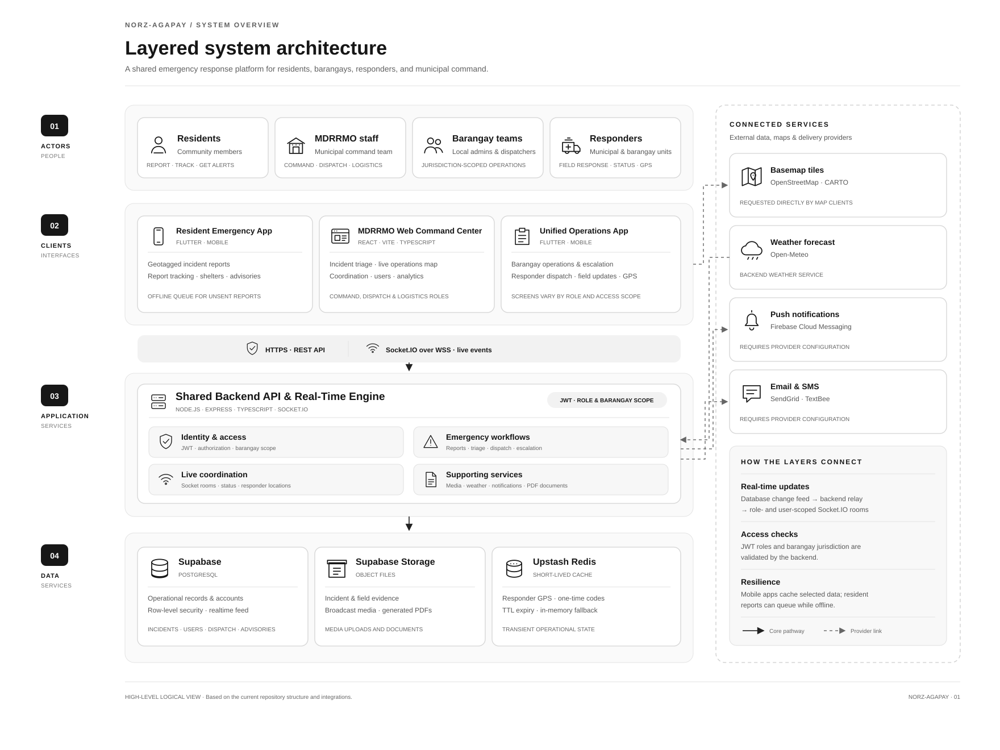

# Norz-Agapay (An Integrated Web and Mobile-Based Emergency Response and Crisis Management Coordination System)

[](https://nodejs.org/)
[](https://www.typescriptlang.org/)
[](https://react.dev/)
[](https://vitejs.dev/)
[](https://flutter.dev/)
[](https://dart.dev/)
[](https://supabase.com/)
[](https://socket.io/)
[](https://upstash.com/)

**Norz-Agapay** is a full-stack, real-time crisis management, emergency response, and multi-agency coordination system developed for the **Municipal Disaster Risk Reduction and Management Office (MDRRMO)** of Norzagaray, Bulacan, in active coordination with **Barangay Local Government Units (BDRRMC)**, **Barangay Tanods (First Responders)**, and **local residents**.

The platform connects residents, barangay teams, MDRRMO command staff, and responders through shared incident reporting, dispatch, GPS tracking, coordination approval, station locations, and public safety advisories.

---

## 📌 System Architecture & Ecosystem

Norz-Agapay is organized into user, client, application, and data layers, with external map, weather, and notification services connected where needed. The diagram shows the three client apps and the shared API/realtime engine.



### 1. 🌐 MDRRMO Web Command Center (`web-dashboard/`)
* **Technology**: React 18, Vite, TypeScript, TailwindCSS / Custom CSS, Leaflet, OpenStreetMap.
* **Target Users**: MDRRMO Master Admins, Admins, Dispatchers, and Logistics staff; barangay Admins, Dispatchers, Responders, and Staff.
* **Key Capabilities**:
  - **Live Command Map & Heatmap**: Real-time geospatial tracking of active incidents, unit positions, and historical severity clusters across all Norzagaray barangays.
  - **Incident & Verification Queue**: Triage emergency reports, inspect uploaded photo/video proof, track operational timelines, and monitor resolution progress.
  - **Inter-Agency Escalation Pipeline**: Review and act upon escalation requests submitted by barangays when incident severity exceeds local capabilities.
  - **Responder Live Monitoring**: Track responder progress from dispatch through return, with map selection from the Command Center.
  - **Evacuation Stations**: Add stations by barangay; residents see the nearest active locations and estimated distance/time.
  - **Weather & Hydromet Monitoring**: Real-time weather integration (PAGASA / Open-Meteo) and Angat / river level gauges for early flood warning.
  - **Dispatcher Accreditation**: Review and verify Barangay Dispatcher credential submissions with prefilled PDF endorsements.

### 2. 📱 Unified MDRRMO and Barangay App (`mobile_app/`)
* **Technology**: Flutter, Dart, Provider, Hive, Flutter Map, Location Service, Socket.IO.
* **Target Users**: MDRRMO responders and barangay Admins, Dispatchers, Responders, and Staff.
* **Key Capabilities**:
  - **Role-specific mobile workspace**: A compact set of mobile screens exposes each account’s permitted operations; backend role and barangay scope checks remain authoritative.
  - **Barangay operations**: Own-barangay incident queue, local dispatch and escalation, assistance requests, team, broadcasts, hotlines, analytics, coordination request, and add-station workflow.
  - **MDRRMO responder workflow**: Assigned dispatch alerts, accept/status updates, GPS tracking, incident-location access, unit membership, resource requests, and field documentation.

### 3. 📱 Resident Mobile Emergency App (`resident_app/`)
* **Technology**: Flutter, Dart, Hive, Image Picker, Location Service, Flutter Map.
* **Target Users**: Residents of Norzagaray, Bulacan.
* **Key Capabilities**:
  - **One-Tap Emergency Reporting**: Quick report submission with auto-detected GPS coordinates, incident type (`flash_flood`, `fire`, `landslide`, `medical_emergency`, `typhoon`, etc.), and media capture.
  - **Flexible Target Routing**: Send reports directly to Barangay, MDRRMO, or All responding authorities.
  - **Report Tracking Timeline**: Monitor the live resolution journey of submitted reports (`pending` ➔ `verified` ➔ `dispatched` ➔ `on_scene` ➔ `resolved`).
  - **Nearest Evacuation Stations**: See the nearest active stations, their distance, and estimated travel time.
  - **Safety Advisories & Weather Alerts**: Receive official municipal disaster bulletins, flood alerts, and emergency notifications.

### 4. ⚡ Central Backend API & Socket Engine (`backend/`)
* **Technology**: Node.js, Express.js, TypeScript, Socket.IO, Supabase Client, Upstash Redis, PDFKit, Zod.
* **Target Role**: Core transaction, event coordination, and data abstraction layer.
* **Key Capabilities**:
  - **Multi-Role JWT Authentication**: Separate MDRRMO, barangay, and resident identity scopes with role-based access checks and shared barangay activation.
  - **Socket.io Real-Time Rooms**: Event routing by role (`commanders`), jurisdiction (`barangay:<id>`), and user (`user:<id>`).
  - **High-Frequency GPS Caching**: Upstash Redis stores live responder coordinates with automatic TTL expiration for power and bandwidth efficiency.
  - **Automated Weather & River Sync**: Background jobs sync meteorological forecasts and water level data every 5 minutes.
  - **Official Document Generation**: Server-side PDFKit service generates standardized Barangay Dispatcher Authorization forms.

---

## 📂 Project Structure

```
NorzAgapay/
├── backend/                  # Node.js + Express + TypeScript API Server
│   ├── src/
│   │   ├── config/           # Supabase, Redis, and Environment Configurations
│   │   ├── middleware/       # JWT Auth, RBAC, Rate Limiting, File Uploads
│   │   ├── routes/           # Auth, Incidents, Dispatches, Barangays, Weather, Evac Centers
│   │   ├── services/         # PDF Generation, Notification, and Hydromet Services
│   │   └── server.ts         # Socket.io event engine & scheduled jobs
│   └── package.json
│
├── web-dashboard/            # MDRRMO Web Portal (React + Vite + TypeScript)
│   ├── src/
│   │   ├── components/       # Live Map, Heatmap, Modals, Navbar, Stat Cards
│   │   ├── context/          # Auth Context & WebSocket Subscriptions
│   │   ├── pages/            # CommandCenter, Verification, EvacCenters, Weather, Reports
│   │   └── App.tsx
│   └── package.json
│
├── mobile_app/               # Unified MDRRMO / Barangay Flutter Mobile App
│   ├── lib/
│   │   ├── screens/          # Barangay operations and MDRRMO mobile workspace
│   │   ├── mdrrmo/           # Responder dispatch, GPS, and task workflows
│   │   └── main.dart
│   └── pubspec.yaml
│
├── resident_app/             # Citizen / Resident Flutter Mobile App
│   ├── lib/
│   │   ├── screens/          # Emergency Report, Camera, My Reports, Evac Centers
│   │   ├── services/         # Offline Report Cache, Auth, and Location Services
│   │   └── main.dart
│   └── pubspec.yaml
│
├── database/                 # Supabase SQL Migrations & Schemas
│   └── migrations/           # Tables, RLS policies, triggers, and indices
│
├── update-tunnel-url.js      # Utility to propagate ngrok/tunnel URLs across all mobile apps
└── README.md                 # System documentation
```

---

## 🔄 Core Operational Workflows

### 1. Incident Reporting to Resolution
1. **Resident Submission**: A resident submits an incident report via `resident_app` with high-accuracy GPS coordinates, category, description, and attached camera photos.
2. **Triage & Verification**: Barangay-routed reports appear in the barangay’s scoped workspace in `mobile_app`; MDRRMO-routed reports appear in the MDRRMO web dashboard. The appropriate dispatcher reviews the report.
3. **Responder Dispatch**: The dispatcher assigns an active responder. A dispatch alert appears in the responder area of `mobile_app`.
4. **Field Response**: The Tanod accepts the dispatch, checks the incident location and coordinates, and updates status to `En Route`, then `On Scene`.
5. **Resolution & Documentation**: Upon resolving the incident, the Tanod uploads proof media and remarks. The status transitions to `Resolved`, immediately updating the resident's tracking timeline and the MDRRMO Command Center.

### 2. Multi-Tier Escalation Pipeline
1. If an incident (e.g., severe flash flood or structure fire) exceeds the response capability of the barangay, the Barangay Administrator triggers an **Escalation Request** with justification notes.
2. The incident escalates to the **MDRRMO Web Command Center** (`web-dashboard`) with high-priority visual markers.
3. MDRRMO command reviews the situation, approves the escalation, and mobilizes municipal emergency units (e.g., BFP, PNP, Municipal Rescue).

### 3. Evacuation Stations
1. Authorized barangay and MDRRMO accounts add a station with its name, address, barangay, and map coordinates in `mobile_app` or `web-dashboard`.
2. Residents use `resident_app` to see the nearest active stations, distance, and estimated travel time.

---

## 🚀 Getting Started

### Prerequisites
* **Node.js**: v18.x or later
* **npm** / **pnpm**
* **Flutter SDK**: 3.x+ with Dart SDK
* **Android Studio / Xcode** (for mobile app building and emulators)
* **Supabase Project**: Cloud or local instance with PostgreSQL
* **Upstash Redis**: URL and token for GPS caching

---

### 1. Database Setup (Supabase)
1. Log in to [Supabase](https://supabase.com/) and create a new project.
2. Open the **SQL Editor** in your Supabase dashboard.
3. Run the migrations located in `database/migrations/`:
   - `migration.sql` (Core tables, schemas, and RLS policies)
   - `dispatcher_verification_migration.sql` (Barangay accreditation schema)
   - `evacuation_centers_migration.sql` (Evacuation shelter tables)
   - `add_send_to_to_incident_reports.sql` (Targeted recipient routing)
   - `add_multiple_proof_and_field_media.sql` (Multi-photo attachments)
4. Ensure **Realtime** is enabled on the `incidents`, `incident_reports`, `alerts`, `evacuation_centers`, and `activity_feed` tables.
5. Create a public Supabase Storage bucket matching `SUPABASE_BUCKET_NAME` (defaults to `norzagapay-files`) for report and broadcast media uploads.

---

### 2. Backend API Setup
```bash
# Navigate to backend directory
cd backend

# Install dependencies
npm install

# Create environment configuration
cp .env.example .env
```

Configure your `.env` with your project credentials:
```env
PORT=3001
NODE_ENV=development
SUPABASE_URL=https://your-project.supabase.co
SUPABASE_SERVICE_ROLE_KEY=your-supabase-service-role-key
JWT_SECRET=your-secure-jwt-secret
UPSTASH_REDIS_REST_URL=https://your-redis.upstash.io
UPSTASH_REDIS_REST_TOKEN=your-redis-token
CORS_ORIGIN=*
```

Start the backend development server:
```bash
npm run dev
```

---

### 3. MDRRMO Web Command Center Setup
```bash
# Navigate to web dashboard directory
cd web-dashboard

# Install dependencies
npm install

# Create environment configuration
# Ensure VITE_API_URL points to your backend (e.g., http://localhost:3001/api)
```

Start the web dashboard:
```bash
npm run dev
```
Open [http://localhost:5173](http://localhost:5173) in your browser.

---

### 4. Mobile Applications Setup (Flutter)

The unified operations app and resident app connect to the backend API:

#### A. Resident Emergency App
```bash
cd resident_app
flutter pub get
# Update lib/core/constants.dart with your API URL
flutter run
```

#### B. Unified MDRRMO and Barangay Operations App
```bash
cd mobile_app
flutter pub get
flutter run
```

> **💡 Multi-Device / Tunnel Testing Tip:**
> If testing on physical mobile devices or over the internet via `ngrok` or `localtunnel`, simply run:
> ```bash
> node update-tunnel-url.js https://your-tunnel-url.ngrok-free.app
> ```
> This script updates the API and WebSocket endpoints for both Flutter apps and the web dashboard.

---

## 👥 User Roles & Access Control

| Role | Client Interface | Scope of Authority |
|---|---|---|
| MDRRMO `master_admin` | Web + Mobile | Full municipal administration, incident oversight, verification, user and unit management, dispatch monitoring, advisories, analytics, weather, resource requests, and a searchable map of barangay-added evacuation stations. |
| MDRRMO `admin` | Web + Mobile | Municipal incidents, account and barangay coordination verification, users, advisories, analytics, weather, and a searchable map of barangay-added evacuation stations. |
| MDRRMO `dispatcher` | Web + Mobile | Incident review and dispatch, command map with live responder locations, and weather monitoring. |
| MDRRMO `logistics` | Web + Mobile | Resource requests, response units, and a searchable map of barangay-added evacuation stations. |
| Barangay `admin` | Web + Mobile | Own-barangay command center, reports, team, assistance, community updates, hotlines, analytics, coordination request, and station entry. |
| Barangay `dispatcher` | Web + Mobile | Own-barangay reports, local dispatch/escalation, assistance decisions, and response status. |
| Barangay `responder` | Web + Mobile | Own-barangay incident response, field updates/media, assistance requests, team functions allowed by the API, GPS, and navigation. |
| Barangay `staff` | Web + Mobile | Barangay community updates, hotlines, and station entry. |
| `resident` | Resident Mobile App | Submitting geotagged incident reports with photos, tracking own report timeline, viewing evacuation shelters, and receiving advisories. |

Barangay access remains scoped to the user's own barangay and is gated by the shared MDRRMO coordination activation. Resident evacuation support is limited to nearest stations, distance, and estimated travel time.

---

## 🛡️ Security & Reliability

* **Multi-Tier Authentication**: Encrypted password storage using `bcryptjs` and stateless session management with JSON Web Tokens (JWT).
* **Row-Level Security (RLS)**: Enforced directly on Supabase PostgreSQL tables so users only query records authorized for their role and jurisdiction.
* **Network Resilience**: Offline caching of loaded safety advisories and offline queueing of unsent incident reports in the mobile apps.
* **Rate Limiting & Sanitation**: API endpoints are protected with `express-rate-limit` and payload validation schemas via `zod`.
* **ISO/IEC 25010:2023 Compliance**: Evaluated across Functional Suitability, Performance Efficiency, Interaction Capability, Reliability, and Security.

---

## 🏫 Academic Background & Research

This project was developed as an undergraduate capstone thesis titled:
> **"NORZ-AGAPAY: AN INTEGRATED WEB AND MOBILE-BASED EMERGENCY RESPONSE AND CRISIS MANAGEMENT COORDINATION SYSTEM"**
> 
> **Institution**: Norzagaray College, College of Computing Studies  
> **Degree**: Bachelor of Science in Computer Science  
> **Location**: Norzagaray, Bulacan, Philippines  
> **Researchers**: Kim Hyster L. Desca, Emmanuel M. Nabus, Maich Richard B. Ponce, Jerzon L. Reminajes, Jerome Rey B. Tatoy

---

## 📄 License

This software is developed for the Municipality of Norzagaray and the College of Computing Studies, Norzagaray College. All rights reserved.
